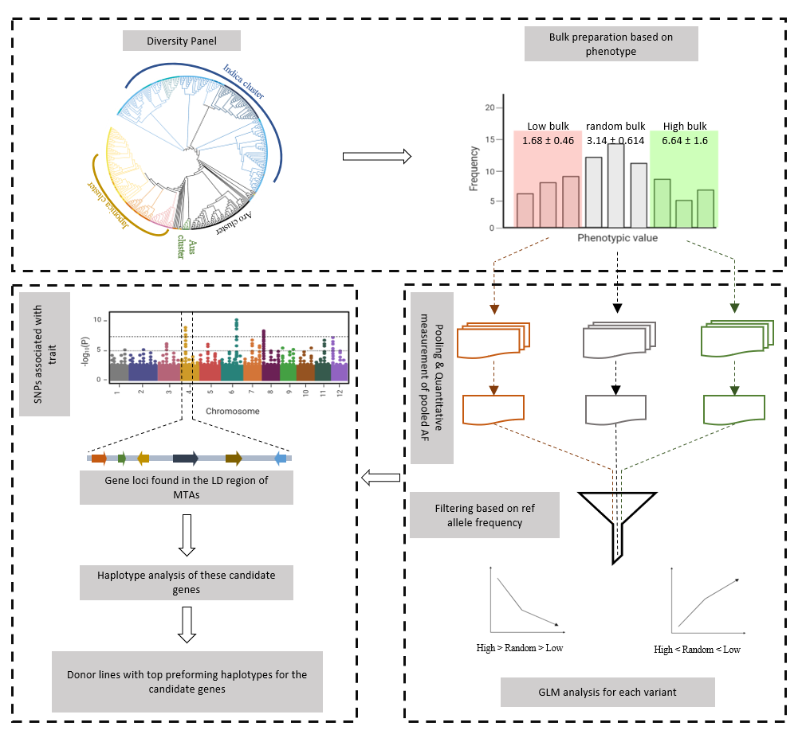
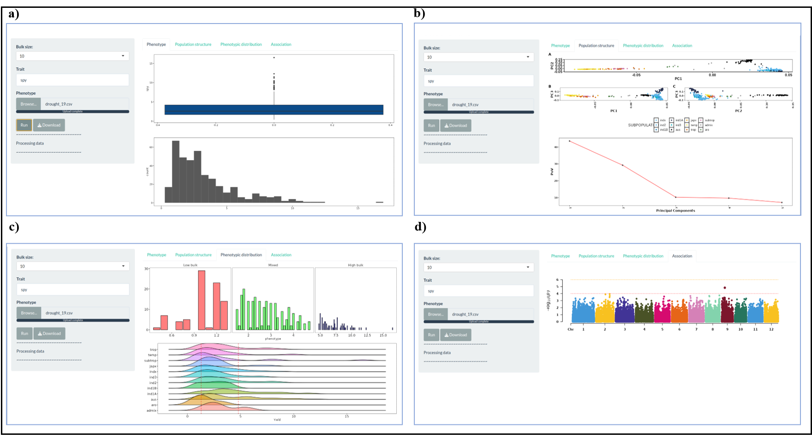

# Et-GWAS

Et-GWAQS is an R package for assocaition study that combines extreme bulk pooling and allele frequency measurement to facilitate the detection of associations between genetic variants and target traits.

## Web tool
Et-GWAS is hosted by a Shiny web server at https://et-gwas.shinyapps.io/Et-GWAS/
This can be utilized for easier and quiker associotion analysis since it utilizes the low density genotypic data with ~30K SNPs.

## Installation
Et-GWAS can be run locally with just one command in R software or RStudio:
```

```
## Requirements
### Genome association analysis toolkits
Et-GWAS requires some of major genome association tools. All these commonad line tools doesn't require separate installation. Download and keep them inside the softwares_external folder that is present with in the Et-GWAS R package. 

General
```
sudo apt-get install unzip
```
1. PLINK1.
```
cd Et-GWAS/softwares_external
wget https://zzz.bwh.harvard.edu/plink/dist/plink-1.07-x86_64.zip
unzip plink-1.07-x86_64.zip
rm -r plink-1.07-x86_64.zip
```
2. PLINK2
```
wget https://s3.amazonaws.com/plink2-assets/alpha5/plink2_linux_x86_64_20231030.zip
unzip plink2_linux_x86_64_20231030.zip
rm-r plink2_linux_x86_64_20231030.zip
```
3. Tassel-5 standalone
```
git clone https://bitbucket.org/tasseladmin/tassel-5-standalone.git
```
4. PopLDdecay
```
git clone https://github.com/hewm2008/PopLDdecay.git 
cd PopLDdecay
chmod 755 configure
./configure
make
cd ../
```

### R packages for datahandling and visualization

After running the above code, the required libraries including "shiny", "shinyjs", "shinythemes", "crayon", "ggplot2", "ggridges", "dplyr", "ggfortify", "ggpubr", "extrafont", "data.table", "CMplot", "foreach", "doParallel", "MASS", and "zip" will be automatically installed. 

## Genotypic data
The genotypic data can be downloaded from the International Rice Informatics Consortium’s (IRIC) SNP-seek database (https://snp-seek.irri.org/_download.zul). There is a 1M GWAS SNP dataset.

## Introduction to method
The Et-GWAS method leverages historical recombination events within a diversity panel to identify rare, high-impact variants associated with the targeted traits. Inspired by the extreme-phenotype GWAS approach, it combines bulk segregant analysis with GWAS, treating the diversity panel as a segregating population. The method uses available genome sequence information to construct extreme pools and a random bulk, representing the genomic variation across the entire diversity panel. The contrasting germplasms are grouped, and allele frequencies are measured to facilitate the detection of marker-trait associations (MTAs). To illustrate the Et-GWAS, we presented a schematic representation in Figure 1, focusing on its application to yield under reproductive stage drought in rice. The analysis involves the following three key steps: 

    1. Sampling: Constructing the diversity panel and bulk preparation based on the trait distribution.
    2. Pooling: Combine the sequence data from the bulks and Quantitative measurement of pooled allele frequency.
    3. Screening: Association analysis and identification of donors with top performing haplotypes
    


Figure 1 The schematic representation of the Et-GWAS pipeline: The workflow consists of three steps, (a) Sampling (b) Pooling of variant information from available sequence data, and (c) Association analysis and identification of donors with top performing haplotypes

## Graphical user interphase and stand-alone package of Et-GWAS 
The Et-GWAS application is user-friendly and requires no prior knowledge of R programming. It operates through a graphical user interface (GUI) that guides users through the process. To begin, users input the desired bulk size, trait name, and phenotypic file on the starting page of the application. Comprehensive instructions regarding data formatting can be found in the documentation below. It can be assessed through  https://et-gwas.shinyapps.io/Et-GWAS/. The functionality of the pipeline and test results are displayed in Figure 2, demonstrating its effectiveness in trait association studies. It is important to note that the Et-GWAS application hosted on the server has a limit of handling 30K markers.  

To accommodate higher marker coverage (5,82,721 SNPs), we recommend launching the application locally by running the code “shiny::runGitHub(“Et-GWAS”, “IRRISouthAsiaHub”)”  in RStudio. This allows for a broader marker range, enhancing the precision and scope of trait discovery and association analysis. For smooth run, it requires a workstation with the memory of 64 GB or above and a CPU speed of 3.0GHz or above.


Figure 2 Main interface of the Et-GWAS application. Screenshots of panels for the main tabs are shown. (a) The “Phenotype” tab displays the phenotypic distribution of the given panel. (b) The “Population structure” tab allows users to visualize the subpopulation structure of the panel. By default 3 principal components are calculated. (c) The “Phenotypic distribution” tab allows users to visualize the phenotypic distribution in each bulk. The users have the flexibility to choose the bulk size according to their panel size. (d) The “Association” tab generates Manhattan plot with two significant values (10-4 & 10-6). Rest of the plots and tables will be generated and kept in a zip file which users can download using the right panel “Download” button at the end of the analysis.
