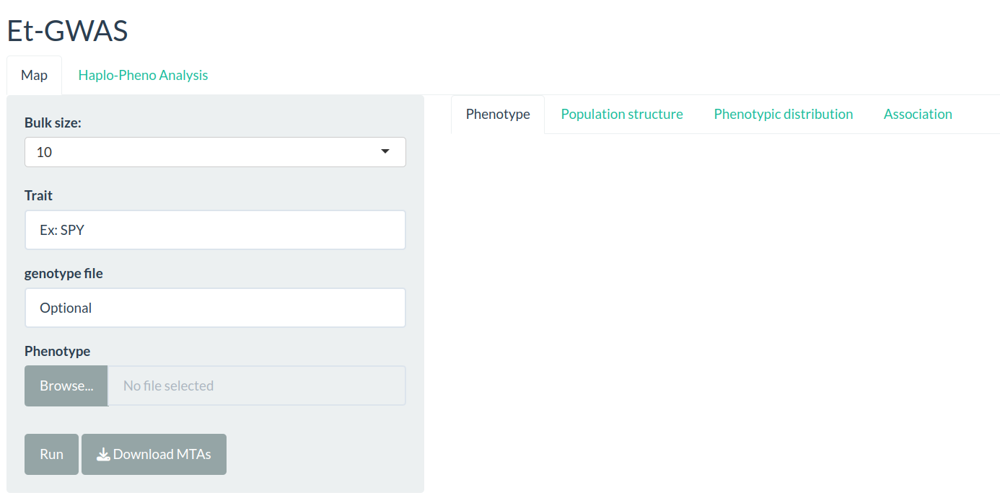
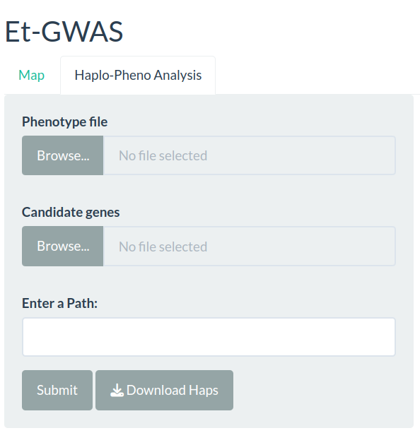

Et-GWAS is an R package for assocaition study that combines extreme bulk pooling and allele frequency measurement to facilitate the detection of associations between genetic variants and target traits. This packages comes two versions, 1) Web tool: This is easier to use. 2) R package: This can be customized by the users. 

# Introduction to method
The Et-GWAS method leverages historical recombination events within a diversity panel to identify rare, high-impact variants associated with the targeted traits. Inspired by the extreme-phenotype GWAS approach, it combines bulk segregant analysis with GWAS, treating the diversity panel as a segregating population. The method uses available genome sequence information to construct extreme pools and a random bulk, representing the genomic variation across the entire diversity panel. The contrasting germplasms are grouped, and allele frequencies are measured to facilitate the detection of marker-trait associations (MTAs). To illustrate the Et-GWAS, we presented a schematic representation in Figure 1, focusing on its application to yield under reproductive stage drought in rice. The analysis involves the following three key steps: 

    1. Sampling: Constructing the diversity panel and bulk preparation based on the trait distribution.
    2. Pooling: Combine the sequence data from the bulks and Quantitative measurement of pooled allele frequency.
    3. Screening: Association analysis and identification of donors with top performing haplotypes
    


Figure 1 The schematic representation of the Et-GWAS pipeline: The workflow consists of three steps, (a) Sampling (b) Pooling of variant information from available sequence data, and (c) Association analysis and identification of donors with top performing haplotypes

# Web tool
This method is easy to use. Et-GWAS is hosted by a Shiny web server at https://et-gwas.shinyapps.io/Et-GWAS/
This can be utilized for easier and quiker associotion analysis since it utilizes the low density genotypic data with ~30K SNPs.

## Graphical user interphase and stand-alone package of Et-GWAS 
The Et-GWAS application is user-friendly and requires no prior knowledge of R programming. It operates through a graphical user interface (GUI) that guides users through the process. To begin, users input the desired bulk size, trait name, and phenotypic file on the starting page of the application. Comprehensive instructions regarding data formatting can be found in the documentation below. It can be assessed through  https://et-gwas.shinyapps.io/Et-GWAS/. The functionality of the pipeline and test results are displayed in Figure 2, demonstrating its effectiveness in trait association studies. It is important to note that the Et-GWAS application hosted on the server has a limit of handling 30K markers.  

To accommodate higher marker coverage (5,82,721 SNPs), we recommend launching the application locally by running the code “shiny::runGitHub(“Et-GWAS”, “IRRISouthAsiaHub”)”  in RStudio. This allows for a broader marker range, enhancing the precision and scope of trait discovery and association analysis. For smooth run, it requires a workstation with the memory of 64 GB or above and a CPU speed of 3.0GHz or above.


Figure 2 Main interface of the Et-GWAS application. Screenshots of panels for the main tabs are shown. (a) The “Phenotype” tab displays the phenotypic distribution of the given panel. (b) The “Population structure” tab allows users to visualize the subpopulation structure of the panel. By default 3 principal components are calculated. (c) The “Phenotypic distribution” tab allows users to visualize the phenotypic distribution in each bulk. The users have the flexibility to choose the bulk size according to their panel size. (d) The “Association” tab generates Manhattan plot with two significant values (10-4 & 10-6). Rest of the plots and tables will be generated and kept in a zip file which users can download using the right panel “Download” button at the end of the analysis.

# R package

## Installation
Et-GWAS can be downloaded from the GitHub repository in different ways. User can directly unzip and start to use it.
Using Git Clone
```
gh repo clone IRRI-South-Asia-Hub/Et-GWAS
```
(or)

Using wget
```
wget https://github.com/IRRI-South-Asia-Hub/Et-GWAS.git
```
## Requirements
### Genome association analysis toolkits
Et-GWAS requires some of major genome association tools. All these commonad line tools doesn't require separate installation. Download and keep them inside the softwares_external folder that is present with in the Et-GWAS R package. Carry out the commands continuously.

General
```
sudo apt-get install unzip
cd Et-GWAS
mkdir softwares_external
cd softwares_external
```
1. PLINK1.07
```
wget https://zzz.bwh.harvard.edu/plink/dist/plink-1.07-x86_64.zip
unzip plink-1.07-x86_64.zip
rm -r plink-1.07-x86_64.zip
```
2. PLINK2
```
wget https://s3.amazonaws.com/plink2-assets/alpha5/plink2_linux_x86_64_20231030.zip
unzip plink2_linux_x86_64_20231030.zip
rm-r plink2_linux_x86_64_20231030.zip
```
3. Tassel-5 standalone
```
git clone https://bitbucket.org/tasseladmin/tassel-5-standalone.git
```
4. PopLDdecay
```
git clone https://github.com/hewm2008/PopLDdecay.git 
cd PopLDdecay
chmod 755 configure
./configure
make
cd ../
```

## Running the R package
This is still a ShinyApp package hence, the users can easily run it with out any coding proficiency.

## Preparation of Phenotypic data
Basic normalization steps are required to prepare the phenotypic trait values. Make sure the genotype of the samples are given in IRIS IDs in the format "IRIS_313-#NO". Please check the demo.csv file inorder to prepare the phenotypic file.

| IRIS.ID        | Trait           | Cool  |
| ------------- |:-------------:| -----:|
| IRIS_313-10007 | 7 | $1600 |
| IRIS_313-10040    | 12.8      |   $12 |
| IRIS_313-10380 | 5.6      |    $1 |


## Downloading Genotypic data (optional)
The package contains a default genotypic file that has low density variants (~30K). The genotypic data can be downloaded from the International Rice Informatics Consortium’s (IRIC) SNP-seek database (https://snp-seek.irri.org/_download.zul). There is a 1M GWAS SNP dataset. This can be done through following steps,
Step 1:
Download plink files (fam/bed/bim format) from the IRIC SNP-seek database
```
wget https://s3.amazonaws.com/3kricegenome/snpseek-dl/3krg-base-filt-core-v0.7/core_v0.7.bed.gz
wget https://s3.amazonaws.com/3kricegenome/snpseek-dl/3krg-base-filt-core-v0.7/core_v0.7.bim.gz
wget https://s3.amazonaws.com/3kricegenome/snpseek-dl/3krg-base-filt-core-v0.7/core_v0.7.fam.gz
```
Step 2:
Unzip and move the files to Et-GWAS location
```
gzip -d core_v0.7.bed.gz
gzip -d core_v0.7.bim.gz
gzip -d core_v0.7.fam.gz
mv core_v0.7.* path-to-Et-GWAS/Et-GWAS/data/
```
Step 3:
Give the name of the new genotype file (without extension) in the interface. This is an optional step, so if the user is not specifing the new genotypic file the analysis will be carried out with the low density ~30K SNP dataset.

## Step 1: Association analysis
Provide  the following information to run the Et-GWAS for your data.

1. Bulk size
2. Trait symbol (files will be generated with this name)
3. Genotypic data (Optional)
4. Provide phenotypic file
5. Run



## Step 2: Candidate genes and SNP sequence downloading
User can extract the candidate genes according to the user's study. Based on the MTAs identified in Step 1, user can identify the candidate genes wither by considering the LD region or just the adjacent genes. These genes (MSU ID) can be used to extract the SNP sequences from SNP seek database (https://snp-seek.irri.org/) using our Haplo-Pheno python package. This script is available at the Python package Index (https://pypi.org/project/Sudip-snpdw/).

## Step 3: Haplo-Pheno Analysis
The candidate gene list and the corresponding SNP sequence should be put in one folder. This information can be again directly used as input for the Haplo-Pheno analysis in the same R package (second tab). After the completion, for each locus (gene) a folder will be generated with all the haplotypes present in the gene and their corresponding phenotypic performance. Based on the performance of these haplotypes, user can idenfity the best performing haplotype by viewing boxplot.jpg and summary.stat.csv file.

